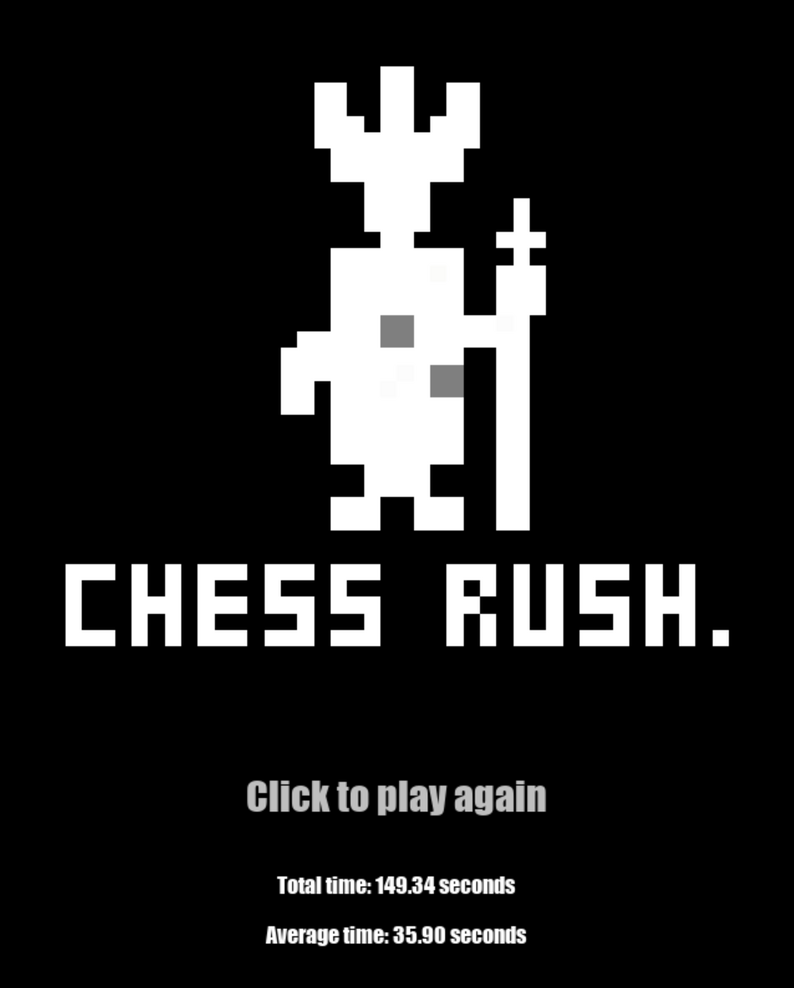
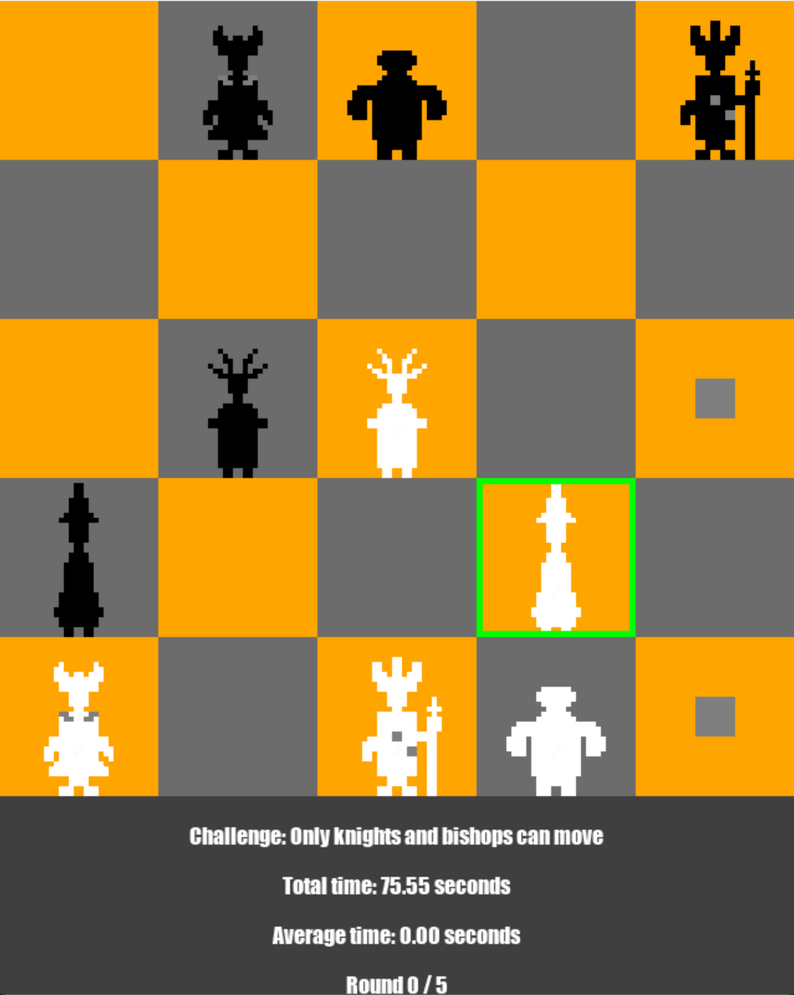

# Chess Rush

Chess-based minigames made using Pygame.

**Play online on itch.io: https://thallaso.itch.io/chess-rush**



Instructions to launch on your own computer:

1. Download the latest release of Python
2. Run the following commands in a terminal:
   ```
      pip install pygame
      pip install asyncio
   ```
4. Download amd extract the GitHub files
5. Navigate to the extracted folder and run
   ```py main.py```
6. Enjoy!




